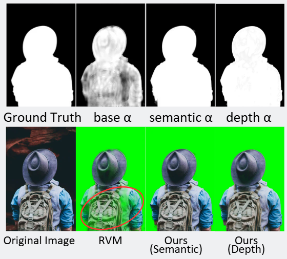
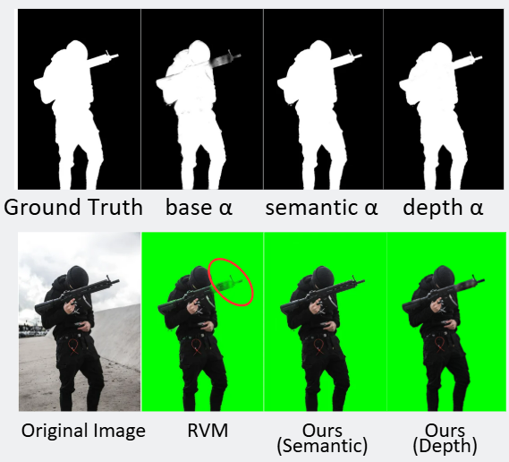

# Depth and Semantic Guided Refinement for Robust Video Matting




## Overview
RVM performs well in video matting but produces unstable alpha in transition regions (hair, soft boundaries, clothing edges). This project proposes two refinement strategies:

- **Depth-Guided Refinement**: Uses depth maps from Depth Anything v3 as spatial cues, with residual learning to correct RVM alpha
- **Semantic-Guided Refinement**: Divides alpha into background/transition/foreground regions with dynamic weighted fusion

## Results
Overall Alpha Evaluation on P3M-500-NP
|Method|MSE|Improvement|SAD|Improvement|
|------|------|------|------|------|
|RVM|0.011966|-|38200.62|-|
|Ours(Depth)|0.010276|14.12%|24949.17|34.69%|
|Our(Semantic)|0.010538|11.93%|26777.40|29.90%|

Transition Region Evalutaion (alpha=0.05~0.95)
|Method|MSE|Improvement|SAD|Improvement|
|------|------|------|------|------|
|RVM|0.077068|-|5636.67|-|
|Ours(Depth)|0.099450|-29.04%|7161.10|-27.04%|
|Our(Semantic)|0.070086|9.06%|5092.14|9.66%|

## Project Stucture
```text
DnS-RVM/
├── config/
│   └── config.yaml
├── data/
│   ├── dataset.py
│   └── preprocess.py
├── models/
│   ├── semantic_refine_net.py
│   ├── losses.py
│   └── rvm_wrapper.py
├── utils/
│   ├── image_utils.py
│   ├── video_utils.py
│   └── metrics.py
├── scripts/
│   ├── generate_dataset.py
│   └── infer_video.py
├── train.py
├── inference.py
├── requirements.txt
└── README.md
```

## Quick Start
```bash
# Install dependencies
pip install -r requirements.txt

# Generate dataset (RVM base_alpha + semantic labels)
python scripts/generate_dataset.py

# Train Semantic Refine Network
python train.py --config config/config.yaml

# Evaluate on P3M-500-NP
python inference.py

# Run video inference
python scripts/infer_video.py --input video.mp4 --output output.mp4
```
## Methodology
### Depth-Guided Refinement
```text
refined_α = base_α + δ * boundary_mask
```
- Input: RGB + RVM alpha + depth map
- Network: Lightweight CNN
```text
Loss = L1(refine_α, gt)
```
### Semantic-Guided Refinement
```text
refined_α = (1-δ) * base_α + δ * semantic_α
```
- Network: U-Net with residual blocks & skip connections
- δ = 1 at transition center, δ → 0 at confident 
```text
Loss = L1(pred, gt) * weight + 0.1 * gradient loss
```
- weight = 3.0 for transition, 0.2 for background/foreground

## References
- [RVM: Robust Video Matting](https://arxiv.org/abs/2108.11515) 
- [Depth Anything V3](https://arxiv.org/pdf/2511.10647)
- [P3M: Privacy-Preserving Portrait Matting](https://arxiv.org/pdf/2104.14222)
- [Robust Video Mattingで高解像度動画から人物切り抜きを試してみる](https://www.youtube.com/watch?v=YbzF-LgL-4o)
